<div align="center">


<br>


<br><br>


<br><br>

<a href="https://github.com/akshit302005">

</a>

<a href="https://www.linkedin.com/in/akshit-dogra/">

</a>

<a href="https://leetcode.com/Akshit2005/">

</a>

<br><br>


</div>

---

<div align="center">

## `01 // CURRENTLY`


</div>

```text
┌──────────────────────────────────────────────────────┐
│                                                      │
│   ROLE       →  SDE Intern                           │
│   COMPANY    →  HighRadius                           │
│   STATUS     →  ● CURRENT                            │
│                                                      │
│   INTERESTS  →  Backend Engineering                  │
│              →  Java & Spring Boot                   │
│              →  Microservices                        │
│              →  Artificial Intelligence               │
│              →  Data Structures & Algorithms          │
│                                                      │
└──────────────────────────────────────────────────────┘
```

---

## `02 // ABOUT ME`

```java
public class AkshitDogra {

    String role = "SDE Intern @ HighRadius";
    String primaryLanguage = "Java";

    String[] interests = {
        "Backend Engineering",
        "Spring Boot",
        "Microservices",
        "Artificial Intelligence",
        "Data Structures & Algorithms"
    };

    String goal =
        "Build reliable and practical software systems.";
}
```

Computer Science Engineering student at **Chitkara University** and currently an **SDE Intern at HighRadius**.

I enjoy building software systems across backend development, APIs, databases, distributed systems, and practical AI applications.

---

<div align="center">

## `03 // TECH STACK`

<br>


<br><br>


</div>

---

<div align="center">

# `04 // PROJECT LAB`

### SYSTEMS I'VE BUILT

</div>

<table>
<tr>

<td width="50%" valign="top">

<div align="center">

### 🎵 MELODEX

**Shazam-like Music Recognition System**

`Python` · `FFT` · `Signal Processing`

</div>

```text
AUDIO
  │
  ▼
FFT PROCESSING
  │
  ▼
FREQUENCY-TIME HASH
  │
  ▼
FINGERPRINT DATABASE
  │
  ▼
SONG MATCH
```

Audio fingerprinting system designed to identify songs from short audio clips.

**Highlights**

* Audio fingerprinting
* FFT-based signal processing
* Frequency-time hashes
* JSON fingerprint database
* Audio matching

</td>

<td width="50%" valign="top">

<div align="center">

### 🏆 SPORTS TOURNAMENT MANAGER

**Spring Boot Microservice Platform**

`Java` · `Spring Boot` · `JWT` · `MongoDB`

</div>

```text
CLIENT
  │
  ▼
REST API
  │
  ├── JWT SECURITY
  │
  ▼
MICROSERVICES
  │
  ▼
DATABASES
```

JWT-secured microservice-based platform with REST APIs.

**Highlights**

* Spring Boot microservices
* JWT authentication
* REST APIs
* MongoDB
* Relational + NoSQL data
* AWS fundamentals

</td>

</tr>

<tr>

<td width="50%" valign="top">

<div align="center">

### 🎧 PODESSEY

**Podcast Playlist Generator**

`Java` · `Custom Data Structures`

</div>

```text
PLAYLIST
   │
   ├── ArrayLinkedList
   ├── Stack
   └── Queue
          │
          ▼
     PLAYLIST CRUD
```

Console-based application built using custom data structures.

**Highlights**

* ArrayLinkedList
* Stack
* Queue
* Admin / Listener roles
* Playlist CRUD

</td>

<td width="50%" valign="top">

<div align="center">

### 🔐 MATRIXACCESS

**IoT RFID Access Control System**

`React.js` · `Node.js` · `REST APIs` · `IoT`

</div>

```text
RFID CARD
    │
    ▼
VALIDATE
    │
    ▼
AUTHORIZE
    │
    ▼
LIVE DASHBOARD
```

RFID-based access-control system with a real-time monitoring dashboard.

**Highlights**

* RFID access control
* Real-time monitoring
* React dashboard
* Node.js backend
* REST APIs

</td>

</tr>
</table>

---

<div align="center">

## `05 // ENGINEERING FOCUS`


</div>

---

# `06 // EXPERIENCE`

### HighRadius

**SDE Intern · Current**

```text
                    HighRadius
                        │
                        ▼
                   SDE INTERNSHIP
                        │
              ┌─────────┼─────────┐
              ▼         ▼         ▼
          SOFTWARE   BACKEND   ENGINEERING
         DEVELOPMENT  SYSTEMS    PRACTICES
```

Currently gaining hands-on experience in a professional software-development environment.

### Cisco Networking Academy

**CISCO-AICTE Virtual Internship Program**
`Jan 2025 – Mar 2025`

* Networking fundamentals
* Routing
* Cybersecurity fundamentals
* Cisco Packet Tracer
* Network configuration simulation

---

<div align="center">

# `07 // GITHUB ANALYTICS`

<br>





<br><br>


</div>

---

<div align="center">

# `08 // CONTRIBUTION MATRIX`

<br>

<picture>

<source
media="(prefers-color-scheme: dark)"
srcset="https://github.com/akshit302005/akshit302005/blob/output/github-contribution-grid-snake-dark.svg"
/>

<source
media="(prefers-color-scheme: light)"
srcset="https://github.com/akshit302005/akshit302005/blob/output/github-contribution-grid-snake.svg"
/>


</picture>

<br><br>


</div>

---

<div align="center">


# `09 // CERTIFICATIONS`

<br>


</div>

---

<div align="center">

# `10 // DEVELOPER LOOP`

<br>


</div>

---

<div align="center">

# `11 // CONNECT`

<br>

<a href="https://github.com/akshit302005">

</a>

<a href="https://www.linkedin.com/in/akshit-dogra/">

</a>

<a href="https://leetcode.com/Akshit2005/">

</a>

<br><br>


<br><br>


</div>
